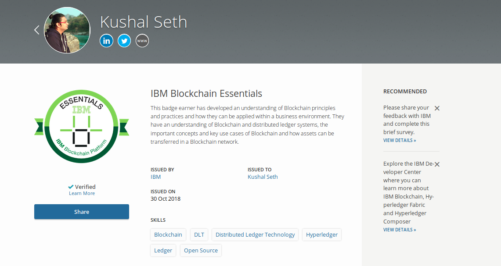
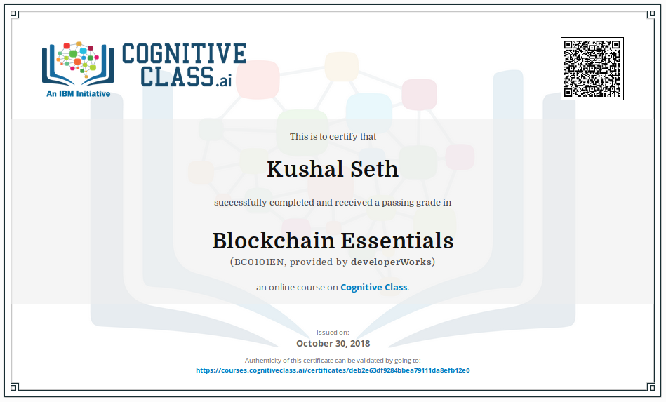

# IBM Blockchain Essentials: BC0101EN

- This course is on @cognitive-class https://cognitiveclass.ai/courses/blockchain-course/ 
- I have made the repo to summerize the skills I have learned in the course.
- I have not shared any quiz/exam answers. 
- - Thanks @cognitive-class and @ibmtraining 
	- My Badget: https://www.youracclaim.com/badges/68e30501-b573-4272-8116-f73b23a4ecda/linked_in

	

	

# Course Outline 

##### Module 1 - Discover Blockchain
- What is blockchain
- The business backdrop
- The problem area
- Relation to bitcoin
- Requirements for blockchain in a business environment
- Requirements deep dive

> Module 1 summerize notes: [Link to notes!](/discover_blockchain.md)

##### Module 2 - Leverage blockchain benefits
- Why blockchain is relevant for business
- Consensus: shared reference data example
- Provenance: supply chain example
- Immutability: audit and compliance example
- Finality: letter of credit example
- Industry use cases
- Customer adoption

> Module 2 summerize notes: [Link to notes!](/leverageblockchain.md)

##### Module 3 - Transform your business with blockchain
- IBM and Hyperledger relationship: Blockchain for business
- Hyperledger Composer
- Public references
- IBM engagement model

> Module 3 summerize notes: [Link to notes!](/business_with_blockchain.md)

##### Demo - Blockchain asset transfer
- Transfer assets in blockchain
- Blockchain asset transfer demo

##### Lab - Transfer assets
- Set up the Hyperledger Composer Playground
- Transfer assets in a blockchain network
- Explore editor views archive data

##### Lab Description
- Car Aution Sample [Transfeerring of asset from one party to another]
- There will be three participants
	- Alice - makes a bid on the Car
	- Bob - makes a bid on the Car
	- Charlie - current owner of the Car